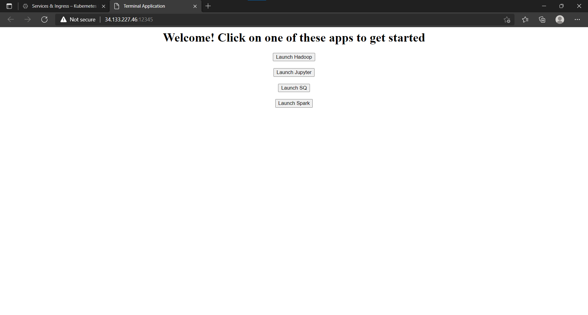

# 14848-project-cp-1

Here is the list of all docker images used for this project -

Jupyter - https://hub.docker.com/r/jupyter/minimal-notebook
Hadoop worker - https://hub.docker.com/r/bde2020/hadoop-datanode
Hadoop master - https://hub.docker.com/r/bde2020/hadoop-namenode
Spark - https://hub.docker.com/r/bitnami/spark
Sonar - https://hub.docker.com/r/ramadasmahale/sonarscanner (My docker image)
Cloud UI - https://hub.docker.com/r/ramadasmahale/cloud-gui (My docker image)

## Steps to deploy all the images ->

All these deployments have been made on GCP's Kubernetes Engine. Hence, before getting started, create a new project and enable Kubernetes Engine on the project. Once done, perform the following steps - 

### Cloud UI

1. Pull the cloud UI into GCP using - `docker pull ramadasmahale/cloud-gui` . Tag the image according to GCP conventions and push to container registry
2. Create a new deployment on GKE by selecting the above deployment. While creating the deployment, leave the default values as is. 
3. Once the deployment is created, expose this as a Loadbalancer service. Be sure to map port 80 to required port(12345 here) while creating the service.
4. Once the service is created, navigate to the URL and you must see - 

